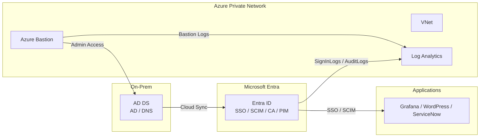

# Entra ID Lab

**Hybrid Identity / SSO / SCIM / Zero Trust / Identity Monitoring**

実務レベルの Microsoft Entra ID 基盤を
**IaC（Terraform）+ 証跡付き（ログ / KQL / スクリーンショット）**で構築したポートフォリオ。

---
# 概要

このリポジトリでは **Microsoft Entra ID を中心とした Identity 基盤**を
実務構成に近い形で構築しています。

実装内容

```
Terraform
↓
Azure Infrastructure
↓
Hybrid Identity（AD + Entra）
↓
Multi App SSO
↓
SCIM Provisioning
↓
Zero Trust
↓
Identity Monitoring
```

対象ロール

* Identity Engineer
* IAM Engineer
* Cloud Security Engineer
* SRE（Identity / Security）

---

# 実装スキル

## Identity / IAM

* Microsoft Entra ID
* Hybrid Identity
* Cloud Sync
* Conditional Access
* Privileged Identity Management
* Access Reviews
* Entitlement Management

---

## Authentication / Federation

* OpenID Connect (OIDC)
* SAML
* Multi App SSO

連携アプリ

* Grafana
* ServiceNow

---

## Provisioning

* SCIM
* Entra ID → SaaS Provisioning
* Provisioning Logs

---

## Infrastructure / IaC

* Terraform
* Azure VNet
* Azure Bastion
* Azure VM
* Log Analytics

---

## Monitoring / Observability

* Azure Monitor
* Log Analytics
* KQL（Kusto Query Language）

ログ監視

* SignInLogs
* AuditLogs
* ProvisioningLogs

---

# Architecture

オンプレミス相当の Active Directory を ID の起点とし
Microsoft Entra ID を中心とした Hybrid Identity / Zero Trust 基盤を構築。

管理アクセスは Azure Bastion 経由のみ。

ログは Log Analytics に集約し
KQL により Identity 監視を行う。



---

# Project Roadmap（12 Weeks）

## Phase0 — Design

* 要件定義
* 技術選定
* 証跡ポリシー

---

## Phase1 — Infrastructure（Terraform）

構築

* Resource Group
* VNet
* Bastion
* Log Analytics

---

## Phase2 — Hybrid Identity

* AD DS 構築
* OU設計
* Cloud Sync
* 属性マッピング

---

## Phase3 — Multi App SSO

SSO 実装

| Application | Protocol |
| ----------- | -------- |
| Grafana     | OIDC     |
| ServiceNow  | SAML     |

---

## Phase4 — SCIM Provisioning

* SCIM モックAPI（FastAPI）
* Entra → ServiceNow 自動ユーザー作成
* Provisioning Logs

---

## Phase5 — Zero Trust

Identity Governance

* Conditional Access
* MFA
* Access Reviews

---

## Phase6 — Identity Monitoring

Entra ID のログを Azure Monitor に集約

監視

* ログイン失敗検知
* アプリ別ログイン分析
* ServiceNow SSOログ
* SCIM同期ログ

例

```kql
SigninLogs
| where ResultType != 0
| summarize count() by UserPrincipalName
```

---

# Documentation

詳細手順

```
docs/
```

* overview
* design
* infrastructure
* cloud sync
* sso
* scim
* zero trust
* monitoring

---

# Evidence

すべてのフェーズで証跡を保存

```
evidence/
```

内容

* Azure Portal screenshots
* Terraform logs
* CLI output
* KQL queries
* Provisioning logs

---

# Learning Outcome

このラボで習得した内容

* Hybrid Identity 設計
* Multi App SSO
* SCIM Provisioning
* Zero Trust
* Identity Monitoring
* Azure Observability

---

# Target Roles

* Identity Engineer
* IAM Engineer
* Cloud Security Engineer
* SRE（Identity / Security）

