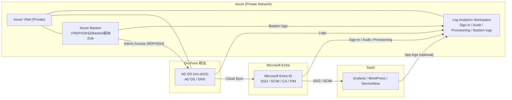

cat > README.md <<'EOF'
# entra-id-lab（Entra ID × SSO 実務ハンズオン / 証跡付き）

## これは何？
Microsoft Entra ID を中心に、**IaC（Terraform）→ ハイブリッドID（Cloud Sync）→ SSO（OIDC/SAML）→ SCIM → Zero Trust/Governance → 監視/SRE** を  
**“証跡付き（ログ/スクショ/KQL/CLI結果）”**で再現する実務ポートフォリオです。

- Entra テナント: `entra-id-lab`
- ローカル: `~/git/github/toku360/entra-id-lab`
- GitHub: `toku360/entra-id-lab`

---

## 全体像（視覚的サマリ）

---

## フェーズ別ロードマップ（12週間）
### Phase 0（設計思想）
- 何を解決する構成か / なぜこの技術選定か / 証跡の取り方を定義

### Phase 1（Week 1–2）：テナントと IaC 基盤構築
- Entra テナント初期設定（Break-glass / 最小権限）
- Terraform で RG/VNet/Subnet/LAW/Bastion を構築
- Diagnostic Settings を LAW に送信して “監査証跡” を残す

### Phase 2（Week 3–4）：ハイブリッド ID（Cloud Sync）
- AD DS 構築、OU設計、属性マッピング設計
- Cloud Sync エージェント導入、同期検証、ログ分析（LAW/KQL）

### Phase 3（Week 5–6）：Multi-App SSO（OIDC/SAML）
- Grafana（OIDC）, WordPress（OIDC）, ServiceNow（SAML）
- サインインログでアプリ別の成功/失敗を証跡化

### Phase 4（Week 7–8）：SCIM + Provisioning
- SCIMモックAPI（FastAPI）を構築
- Entra から自動プロビジョニング、Provisioning Logs で証跡化

### Phase 5（Week 9–10）：Zero Trust + Governance
- Conditional Access（Report-only → 段階適用）
- PIM（JIT昇格）/ Access Reviews / Entitlement Management

### Phase 6（Week 11–12）：監視・SRE運用
- KQL ワークブックで失敗率・遅延・監査イベントを可視化
- SLI/SLO と Runbook（障害対応）を整備

---

## ドキュメント（入口）
- 全体計画: docs/00-overview.md
- 証跡ルール: docs/01-evidence-policy.md
- Phase 0: docs/phase0-design.md
- Phase 1: docs/phase1-infra.md
- Phase 2: docs/phase2-cloud-sync.md
- Phase 3: docs/phase3-sso.md
- Phase 4: docs/phase4-scim.md
- Phase 5: docs/phase5-zero-trust.md
- Phase 6: docs/phase6-sre.md

---

## 証跡（evidence/）
各Phaseで以下を保存します：
- screenshots/: Azure Portal の設定完了が分かる画面
- logs/: CLI出力 / terraform plan/apply / KQL結果（個人情報はマスク）
EOF

