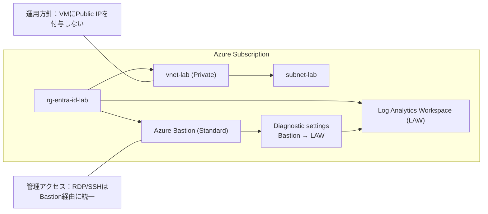

# Phase 1：Terraform × Azure 基盤（RG/VNet/LAW/Bastion）【証跡付き】

## 1. ゴール（完了条件）
- Terraform で以下が作成されている
  - Resource Group
  - Virtual Network / Subnet
  - Log Analytics Workspace（LAW）
  - Azure Bastion（Standard）
- Bastion の Diagnostic settings を LAW に送信し、KQL でログが確認できる
- 証跡（スクショ・ログ・KQL結果）が `evidence/phase1/` に揃っている

---

## 2. アーキテクチャ（Phase 1）

## 仮想マシンを Phase 1 で作成しない理由

- Phase 1 は管理・監査・ネットワーク基盤の確立が目的
- VM を先に作成すると、管理経路や証跡が未整備になる
- Bastion + Log Analytics を先に構築し、
  すべての管理操作を監査可能にしてから VM を追加する設計とした

## ログ取得状況について

- Phase 1 では AzureMetrics の取得を確認
- AzureDiagnostics / AzureActivity は未取得
- 理由：
  - VM 未作成
  - Bastion 接続イベント未発生
  - Activity Log を LAW に送信していない
- Phase 2 で VM 作成・Bastion 接続後に取得予定

