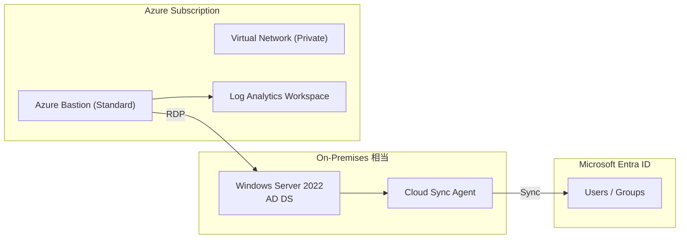
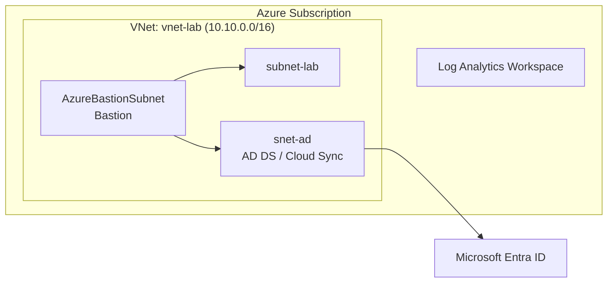

# Phase 2：ハイブリッド ID 実装（Azure Bastion 組み込み）

## 1. フェーズの目的

Phase 2 では、Phase 1 で構築した「管理・監査・ネットワーク基盤」の上に、Hybrid Identity 構成を構築する。

### このフェーズで実現すること
- オンプレ AD（相当）＋ Entra ID のハイブリッド構成
- Cloud Sync による ID 同期
- Azure Bastion 経由のみの管理アクセス
- 管理操作・接続操作の証跡取得（Log Analytics）

---

## 2. 目標アーキテクチャ

### 2.1 全体像

- オンプレ相当：
  - Windows Server 2022
    - AD DS
    - Entra Cloud Sync Agent
- クラウド：
  - Microsoft Entra ID
  - Azure Virtual Network（Private）
  - Azure Bastion（Standard SKU）
  - Log Analytics Workspace

---

## 2.2 アーキテクチャ図（Mermaid）



## Step 2-3：AD 用サブネット設計

### 設計方針
- Active Directory / Cloud Sync は ID 基盤の中核であり、他ワークロードから論理的に分離する
- Bastion / 汎用 VM と同一サブネットに配置しないことで、横断的な侵害リスクを低減
- 将来の NSG/UDR/Private Endpoint 適用を前提とした責務分離

### サブネット構成
| サブネット名 | CIDR | 役割 |
|---|---|---|
| subnet-lab | 10.10.1.0/24 | 汎用 / 将来拡張 |
| AzureBastionSubnet | 10.10.2.0/26 | Bastion 専用 |
| snet-ad | 10.10.10.0/24 | AD DS / Cloud Sync |

### snet-ad を分離する理由
- AD 通信（LDAP/Kerberos/DNS）を明確に制御できる
- NSG によるポート制御（389/636/88/445 等）が可能
- 同期エージェントの通信経路を限定できる
- Zero Trust 設計（後続 Phase）の前提条件を満たす


### 全体アーキテクチャ図



### ID同期アーキテクチャ図

```mermaid
flowchart LR

subgraph Azure VNet (10.10.0.0/16)
DC["vm-dc01<br>AD DS / DNS<br>10.10.10.4"]
AG["ad01<br>Cloud Sync Agent<br>10.10.10.5"]
end

Entra["Microsoft Entra ID<br>entra-id-lab"]

DC --> AG
AG --> Entra
```

---

## 3. Cloud Sync 詳細設計

### 3.1 サーバ構成

| サーバ | 役割 | IP | 備考 |
|--------|------|----|------|
| vm-dc01 | Domain Controller (AD DS / DNS) | 10.10.10.4 | Forest: entra-id.lab |
| ad01 | Domain Member / Cloud Sync Agent | 10.10.10.5 | gMSA 利用 |

---

### 3.2 設計思想

- Domain Controller には Cloud Sync Agent を直接導入しない
- 同期エージェントはメンバーサーバへ分離配置
- AD と Entra 間は最小権限での同期構成
- 将来的な冗長化（Agent 追加）を想定

---


### 3.3 ネットワーク設計

#### AD 関連通信（内部）

| プロトコル | ポート | 用途 |
|------------|--------|------|
| LDAP | 389 | 認証 / 属性取得 |
| Kerberos | 88 | 認証 |
| DNS | 53 | 名前解決 |
| SMB | 445 | GPO / SYSVOL |

内部通信は snet-ad 内で許可。

---

#### Cloud Sync Agent アウトバウンド通信

Agent は以下のエンドポイントへ HTTPS 通信を行う。

| 宛先 | ポート | 用途 |
|------|--------|------|
| *.msappproxy.net | 443 | サービス接続 |
| *.servicebus.windows.net | 443 | メッセージング |
| login.microsoftonline.com | 443 | 認証 |

---

### 3.4 NSG 設計方針

- 受信：最小限のみ許可
- 送信：Internet 443 を許可（Cloud Sync 用）

#### vm-dc01 NSG
- Bastion からの RDP 許可
- snet-ad 内通信許可
- それ以外は拒否

#### ad01 NSG
- snet-ad 内通信許可
- Internet 443 outbound 許可
- 受信は内部通信のみ

---

### 3.5 KDS / gMSA 構成

Cloud Sync は gMSA を使用するため、以下を実施。

```powershell
Add-KdsRootKey -EffectiveImmediately


---

## Phase2 完了判定

以下を満たしたため Phase2 を完了とする。

- AD DS 構築完了
- DNS 正常動作
- VNet DNS 設定済み
- NSG 設計適用
- Cloud Sync Agent Active
- Provisioning Success ログ確認済み


